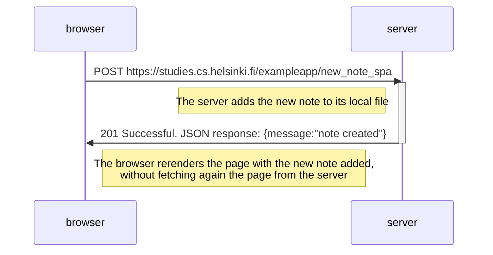

Exercise 0.6

```mermaid
  sequenceDiagram
    participant browser
    participant server

    browser->>server: POST https://studies.cs.helsinki.fi/exampleapp/new_note_spa
    activate server
    Note left of server: The server adds the new note to its local file
    server ->> browser: 201 Successful. JSON response: {message:"note created"}
    deactivate server

    Note right of browser: The browser rerenders the page with the new note added,<br>without fetching again the page from the server
```
